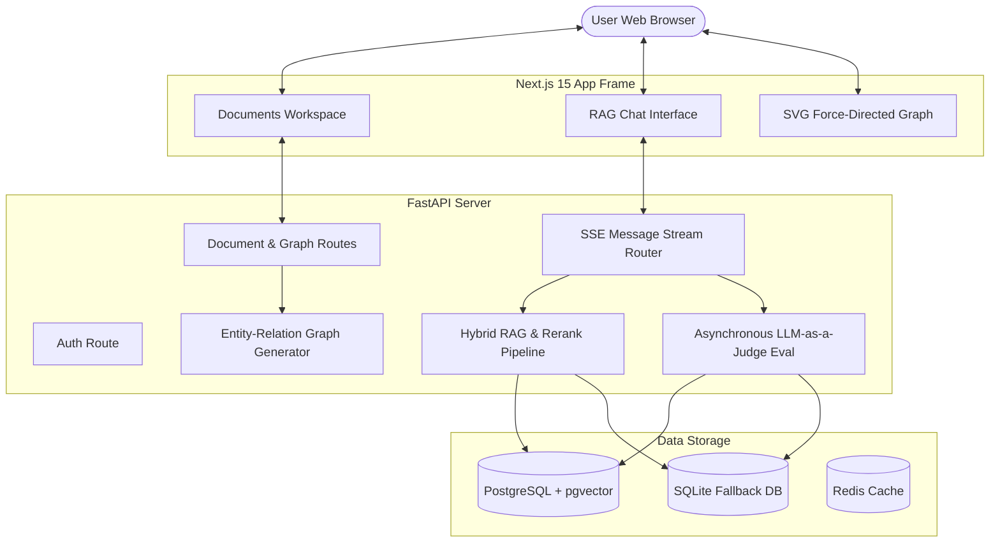
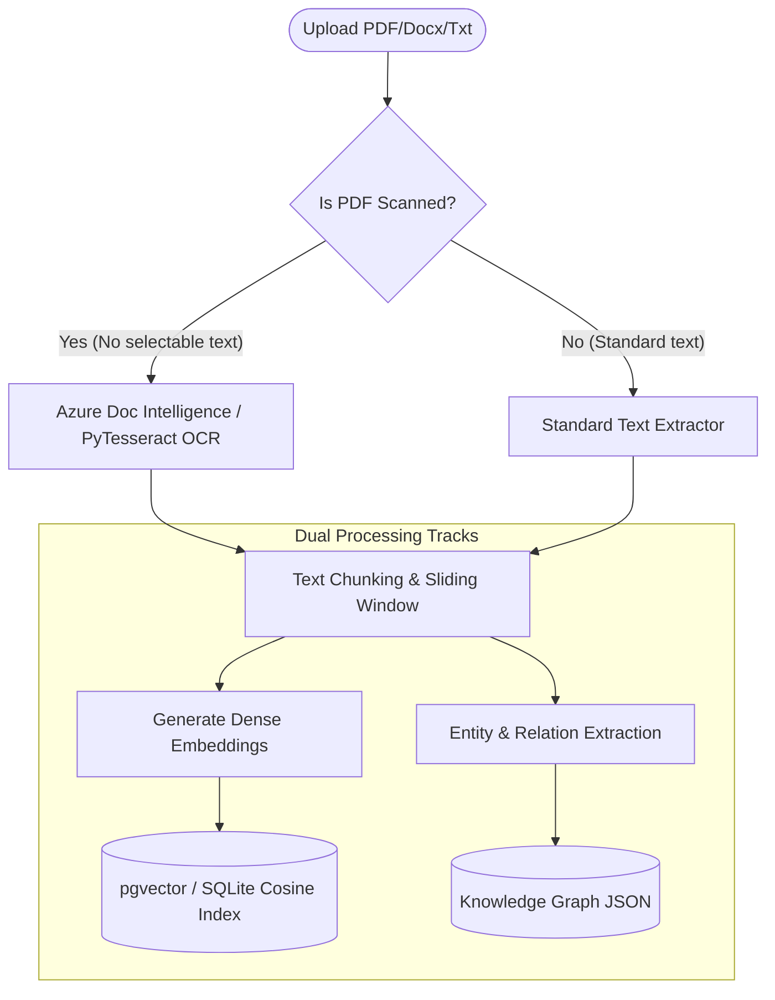
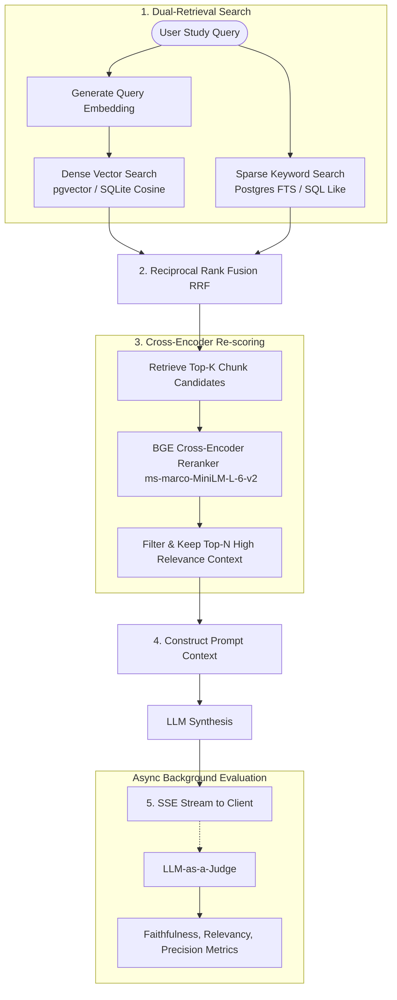

# SmartDoc AI - RAG-Powered Document Intelligence & Knowledge Map Platform

SmartDoc AI is an advanced, resume-grade document intelligence SaaS platform that allows users to upload, search, visualize, and chat with their document stack. By automatically extracting concepts and mapping them to visual networks, it transforms static reading materials into active, interactive learning workspaces.

---

## 🎓 The Inspiration (Why SmartDoc AI?)

SmartDoc AI was inspired by a common academic challenge: **Exam Preparation under Time Constraints**. 

During exams, students are often overwhelmed with dozens of massive textbooks, research papers, slide decks, and reference PDFs, but have very little time left to study. Reading everything linearly is simply impossible. 

SmartDoc AI was built to solve this by providing:
- **Instant Concept Extraction**: Don't read 100 pages to find one connection.
- **Visual Entity Mapping (Knowledge Graph)**: See how equations, systems, concepts, and terminologies connect visually.
- **Interactive Retrieval-Augmented Generation (RAG) Chat**: Ask questions directly to your PDF stack, and get grounded, cited answers instantly.
- **Voice Study Mode**: Study hands-free with built-in voice commands (Speech-to-Text) and auditory readouts (Text-to-Speech).
- **Rapid Revision Sheets**: Instantly download professional PDF summaries of your study sessions to review on the go.

---

## 🗺️ System Diagrams & Architecture Flows

To help visualize how data flows through the application during study sessions, review the pipelines below:

### 1. High-Level System Architecture
This diagram outlines the connections between the React/Next.js client interface, the asynchronous FastAPI backend, and the hybrid database layer:



### 2. Document Upload & Ingestion Pipeline
When you upload a textbook or study guide PDF, it runs through this multi-format parsing, chunking, and dual-indexing pipeline:



### 3. Hybrid RAG Retrieval & Reranking Flow
When you ask the AI a question (e.g. during active revision), the query executes this advanced hybrid search and re-scoring process to fetch highly-precise study contexts:



---

## 🔥 Core Features & Functionalities

### 1. Dual-Pane RAG Workspace
The core study interface splits into two interactive panels:
- **Right Panel (AI Study Partner)**: Interactive RAG chat assistant that responds in real-time (using SSE streaming). Every answer is grounded directly in your document context and contains clickable citation indices.
- **Left Panel (Document Viewers)**: 
  - **Document Layout**: Displays parsed document paragraphs. Clicking an AI citation highlights and scrolls directly to the source text.
  - **Knowledge Map**: Rendered SVG graph visualizing concepts and connections.

### 2. Force-Directed Knowledge Graphs
- Automatically parses document contents to extract main entities and their relationships.
- Renders an interactive, zoomable, and pannable SVG canvas showing how topics connect.
- Clicking on nodes isolates specific concepts, helping you study relational subjects (e.g. computer network maps, system structures, history timelines).

### 3. Advanced Hybrid Search & Reranking (Production-Grade)
- **Dense Retrieval**: Generates vector embeddings for document chunks using Sentence-Transformers and index searches them using `pgvector`.
- **Sparse Retrieval**: Performs keyword matching using native PostgreSQL Full-Text Search (FTS).
- **Reciprocal Rank Fusion (RRF)**: Merges the dense and sparse search results mathematically to get the best of both keyword-matching and semantic understanding.
- **Cross-Encoder Reranker**: Runs hits through a MiniLM Cross-Encoder (`ms-marco-MiniLM-L-6-v2`) to re-score and prioritize only the highest-relevance context blocks for the LLM.

### 4. RAG Quality Evaluation (LLM-as-a-Judge)
- An asynchronous evaluation engine scores RAG answers in real-time.
- Displays metrics on **Faithfulness** (no hallucinations), **Answer Relevancy** (addresses the query), and **Context Precision** (accurate source retrieval) to ensure study integrity.

### 5. Multi-Format Intelligent Parsing & OCR
- Supports `.pdf`, `.docx`, `.txt`, and `.md` file formats.
- Features scanned PDF auto-detection: if a PDF is an image scan, it automatically falls back to **Azure Document Intelligence** or local **PyTesseract OCR** to extract text.
- Fallback local database support: if Postgres is not running, the backend seamlessly boots into local **SQLite** (`smartdoc.db`) utilizing **NumPy** for vector cosine similarity math.

### 6. Built-in Accessibility & Voice Tools
- Uses the Web Speech API to provide hands-free study options.
- **Speech-to-Text (STT)**: Speak into your microphone to type study questions.
- **Text-to-Speech (TTS)**: Listen to the assistant read out study material and explanations.

### 7. Professional PDF Exports
- Generates clean, publication-ready PDF summaries of your study chat histories using **ReportLab** so you can export notes and print them.

---

## 🛠️ Technical Stack

- **Frontend**: Next.js 15 (App Router), React, Tailwind CSS (Custom Obsidian Theme), Lucide Icons, Framer Motion.
- **Backend**: FastAPI (Python), Uvicorn, SQLAlchemy ORM.
- **Database**: PostgreSQL with `pgvector` extension (production) & SQLite with NumPy calculations (local fallback).
- **NLP / ML Models**: LangChain, Sentence-Transformers, MS-Marco Cross-Encoder Reranker.
- **Deployment**: Docker, Docker Compose.

---

## 📂 Folder Structure

```
Smart-Doc-AI-Assistant/
├── backend/
│   ├── app/
│   │   ├── api/            # auth, documents, chats, analytics routing
│   │   ├── core/           # JWT security, config schemas, passwords
│   │   ├── db/             # pgvector connection & SQLite fallback logic
│   │   ├── models/         # database models (Users, Documents, Graphs, Chats)
│   │   ├── services/       # doc parsers, hybrid RAG pipeline, reranker, OCR, RAG evaluations
│   │   └── main.py         # App entrypoint and startup database creation
│   ├── Dockerfile
│   └── requirements.txt
├── frontend/
│   ├── src/
│   │   ├── app/            # Landing page, Login/Signup, Dashboard, Chat panel, Providers
│   │   ├── components/     # UI components (collapsible sidebar, layouts)
│   │   └── lib/            # Axios/Fetch API wrapper client
│   ├── Dockerfile
│   ├── package.json
│   └── tailwind.config.js
├── docker-compose.yml
├── .env.example
└── README.md
```

---

## 🚀 Local Development & Setup (Windows & macOS/Linux)

You can run the entire platform using Docker Compose or execute services manually.

### Option A: Using Docker Compose (Recommended)
This launches PostgreSQL (with pgvector), Redis, the FastAPI backend, and Next.js frontend out-of-the-box.

1. Create a `.env` file in the root directory (copy from `.env.example`).
2. Launch the container stack:
   ```bash
   docker compose up --build
   ```
3. Access the applications:
   - **Frontend**: `http://localhost:3000`
   - **FastAPI Documentation**: `http://localhost:8000/api/docs`

---

### Option B: Manual Installation

#### 1. Setup Backend
1. Open a terminal and navigate to the backend directory:
   ```powershell
   cd backend
   ```
2. Create a Python virtual environment:
   ```powershell
   python -m venv venv
   ```
3. Activate the virtual environment:
   - **Windows (PowerShell)**: `.\venv\Scripts\activate`
   - **macOS/Linux**: `source venv/bin/activate`
4. Install dependencies:
   ```bash
   pip install -r requirements.txt
   ```
5. Run the FastAPI application:
   - **Direct Script execution (Windows-friendly, handles pathing and DB initialization)**:
     ```powershell
     .\venv\Scripts\python.exe app/main.py
     ```
   - **Uvicorn execution (with auto-reload enabled)**:
     ```bash
     uvicorn backend.app.main:app --reload
     ```
   
   *Note: If PostgreSQL is not active, the system automatically writes to a local SQLite database (`smartdoc.db` in the backend directory) and performs vector operations using NumPy calculations.*

#### 2. Setup Frontend
1. Open a new terminal and navigate to the frontend directory:
   ```bash
   cd frontend
   ```
2. Install npm dependencies:
   ```bash
   npm install
   ```
3. Start the Next.js development server:
   ```bash
   npm run dev
   ```
4. Open your browser and navigate to `http://localhost:3000`.
